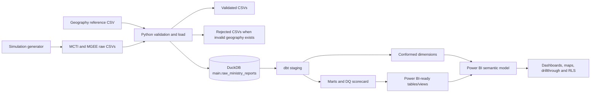

# Existing Project Inventory

This report records the repository as inspected on 20 July 2026. Counts are from the committed CSV files and the committed `database/ministry_mis.duckdb`; generated environments, caches, logs, compiled dbt artifacts, and temporary outputs are excluded.

## 1. Original business problem

The repository is a portfolio/consultancy-style simulation of a government Ministry Monitoring, Evaluation, Learning and Management Information System (MEL/MIS), not evidence of a production deployment. It was created to show how fragmented ministry submissions can be turned into governed, decision-ready analytics where slow reporting, inconsistent performance views, poor data-quality visibility, and limited movement from submissions to action are the stated problems.

The simulated organisations are Zambia's Ministry of Commerce, Trade and Industry (MCTI) and Ministry of Green Economy and Environment (MGEE). The intended users named in the documentation are ministry leadership and directors, executives and senior management, program managers and technical leads, M&E and reporting officers, data managers and quality-assurance teams, analysts, provincial/regional teams, donor representatives, strategic planners, and technical reviewers. The supported decisions include KPI and target monitoring, ministry/program/indicator comparison, province and district follow-up, trend review, geographic prioritisation, data-quality remediation, and province-scoped access.

No separate client brief, statement of work, or real consultancy assignment is present. The stated assignment is the repository's own end-to-end analytics engineering and Power BI portfolio simulation.

## 2. Existing architecture

### Inputs and ingestion

- `MCTI/raw_submissions/MCTI_WEIGHTED_2025_2026.csv` and `MGEE/raw_submissions/MGEE_WEIGHTED_2025_2026.csv` are the only CSVs read by the configured loader.
- `shared_reference/geography/ref_geography.csv` supplies valid province/district pairs.
- `MCTI/metadata/mcti_programs.csv` and `MGEE/metadata/mgee_programs.csv` exist, but no current script or dbt model reads them.
- `simulation_scripts/generate_weighted_ministry_data.py` deterministically generates the two weighted raw files (`random.seed(42)`), including controlled null and negative-value defects.

### Python scripts

| Script | Implemented purpose |
|---|---|
| `simulation_scripts/generate_weighted_ministry_data.py` | Generates monthly 2025 MCTI and MGEE district/program/indicator CSV data with province/ministry weights and controlled DQ defects. |
| `ingestion/scripts/load_ministry_reports.py` | Validates province/district pairs, writes valid and rejected CSVs, appends valid rows to DuckDB `raw_ministry_reports`, and prints counts by ministry. |
| `ingestion/scripts/query_duckdb.py` | Prints a raw preview, ministry counts, and an aggregated performance query. |
| `ingestion/scripts/create_semantic_marts.py` | Creates legacy/direct DuckDB views named `mart_ministry_performance` and `mart_executive_summary` without dbt. |
| `ingestion/scripts/create_dq_scorecard.py` | Creates a legacy/direct DuckDB `mart_dq_scorecard` view without dbt. |

### DuckDB and dbt

The repository contains one DuckDB file, `database/ministry_mis.duckdb`, and all inspected objects are in the `main` schema. Persisted tables are `raw_ministry_reports`, `dim_date`, `dim_geography`, `dim_ministry`, `dim_period`, `dim_province`, and `pbi_ministry_performance`. Views are `stg_ministry_reports`, `mart_ministry_performance`, `mart_executive_summary`, `mart_dq_scorecard`, `pbi_ministry_performance`'s downstream peers `pbi_executive_summary`, `pbi_dq_scorecard`, and `pbi_dq_exceptions` (the first Power BI model is a table; the other three are views).

The dbt project is `dbt_ministry_mis/ministry_mis`, named/profiled `ministry_mis`. Its flow is:

`raw_ministry_reports` -> `stg_ministry_reports` -> dimensions and marts -> Power BI models. Folder defaults are views, while individual dimension models and `pbi_ministry_performance` override materialisation to tables. There are no implemented intermediate models.

### Power BI and outputs

The Power BI Desktop file is `dbt_ministry_mis/ministry_mis/models/powerbi/pbix/mcti_mgee_sim.pbix`. Documentation says Power BI connects to DuckDB through ODBC. Seven committed screenshots document Executive Overview, Ministry Performance, Data Quality, Time Intelligence, Geospatial Map, RLS Demo, and Province Drillthrough. `architecture/solution_architecture.png` is the existing architecture image; `architecture/architecture.zip` is a supporting archive.

## 3. Repository structure

| Important path | Purpose |
|---|---|
| `MCTI/`, `MGEE/` | Ministry raw submissions and program metadata. |
| `shared_reference/geography/` | Province/district reference data used for validation. |
| `simulation_scripts/` | Synthetic source-data generation. |
| `ingestion/scripts/` | Validation, DuckDB loading/querying, and direct mart creation utilities. |
| `ingestion/validated/`, `ingestion/rejected/` | Validation outputs; four validated CSVs exist and the rejected folder is empty. |
| `database/` | Committed DuckDB analytical database. |
| `dbt_ministry_mis/ministry_mis/` | dbt project, SQL models, tests declared in YAML, and PBIX artifact. |
| `Docs/` | Executive, architecture, dashboard, lessons, portfolio, and oversight documentation. |
| `screenshots/` | Seven rendered Power BI report-page images. |
| `architecture/` | Architecture image and supporting archive. |

`consultancy_outputs/` is present but empty and therefore has no evidenced current role.

## 4. Data sources

| Source/artifact | Format | Main entities | Approximate rows |
|---|---|---|---:|
| `MCTI/raw_submissions/MCTI_WEIGHTED_2025_2026.csv` | CSV | Monthly district-level MCTI program indicators, reported/target values, officer and submission fields | 8,640 |
| `MGEE/raw_submissions/MGEE_WEIGHTED_2025_2026.csv` | CSV | Monthly district-level MGEE program indicators, reported/target values, officer and submission fields | 7,200 |
| `shared_reference/geography/ref_geography.csv` | CSV | Province/district reference pairs | 30 |
| `MCTI/metadata/mcti_programs.csv` | CSV | MCTI program, directorate, frequency, donor, active flag | 3 |
| `MGEE/metadata/mgee_programs.csv` | CSV | MGEE program metadata of the same form | 3 |
| `ingestion/validated/VALIDATED_*_WEIGHTED_2025_2026.csv` | CSV | Validated copies of the two weighted sources, plus `is_valid_geo` | 8,640 and 7,200 |
| `ingestion/validated/*_Q1_2026_Eastern.csv` | CSV | Small MCTI MSME and MGEE Climate validated samples | 3 each |

The committed database has 15,840 raw rows: MCTI 8,640 and MGEE 7,200. Each ministry covers 12 reporting periods, 10 provinces, 30 districts, and 4 programs; MCTI has 6 indicators and MGEE 5. The two three-row Q1 2026 validated samples are not in the configured raw input folders and are not represented in the committed raw table.

## 5. Data model

| Layer/model | Grain and evident keys |
|---|---|
| `raw_ministry_reports` | One loaded submission row per ministry/source file/period/province/district/program/indicator; no declared primary key. Includes values, officer, submission date, and ingestion timestamp. |
| `stg_ministry_reports` | Same row grain (15,840); casts types and derives integer month-start `date_key` (`YYYYMM01`). |
| Intermediate | No intermediate model folder or SQL models exist. |
| `dim_date` | One calendar day for 2025 (365 rows), keyed in practice by `date_key`; includes year, month, quarter and year-month. |
| `dim_period` | One reporting period (12 rows), with `reporting_period` and month-start `date_key`. |
| `dim_ministry` | One ministry (2 rows), natural key `ministry`. |
| `dim_province` | One province (10 rows), natural key `province`. |
| `dim_geography` | One distinct province/district pair (30 rows); the pair is the evident composite key. |
| `mart_ministry_performance` | One ministry/period/date/province/district/program/indicator group (15,840 rows); sums values and derives variance and achievement %. |
| `mart_executive_summary` | One ministry/period/province group (240 rows); reporting counts and total values/variance. |
| `mart_dq_scorecard` | One ministry/period/date/province group (240 rows); defect counts, district count and DQ score. |
| `pbi_ministry_performance` | Copy of performance-mart grain, materialised as a table (15,840 rows). |
| `pbi_executive_summary` | Executive-mart grain, view (240 rows). |
| `pbi_dq_scorecard` | DQ-scorecard grain, view (240 rows). |
| `pbi_dq_exceptions` | One defective staging row (939 rows), with a single prioritised issue type and exception flag. |

No separate fact model is named `fact_*`; the performance mart/Power BI table and summary/DQ views are the fact-style reporting objects. No database constraints are declared in the inspected model SQL.

## 6. Data quality

The loader's only rejection rule is exact case-normalised membership of the `(province, district)` pair in `ref_geography.csv`. Invalid rows are written to `ingestion/rejected/REJECTED_<source>` and are not loaded; the committed rejected folder is empty. Valid rows are written to `ingestion/validated/`.

`schema.yml` declares `not_null` dbt tests on staging `ministry`, `reporting_period`, `province`, `district`, `program_id`, `indicator_code`, `reported_value`, and `target_value`; and on performance-mart `ministry`, `reporting_period`, `program_id`, and `indicator_code`. There are no declared uniqueness, relationship, accepted-values, source freshness, or custom SQL tests.

The DQ scorecard counts missing and negative reported and target values and calculates a percentage after subtracting all four defect counts. The exception view emits rows with any of those defects; its `CASE` reports only the first matching category in this order: missing reported, negative reported, missing target, negative target. In the committed raw data there are 483 missing reported, 227 missing target, 143 negative reported, and 86 negative target values, producing 939 exception rows. These value defects remain in the analytical data; they are flagged, not rejected or quarantined. Geography-invalid records would be file-quarantined, but none are committed.

## 7. Reporting

The single PBIX is accompanied by seven screenshot-confirmed pages/artifacts:

- **Executive Overview:** total reported value, total target value, achievement %, districts reporting, province comparison, and ministry contribution; intended for leaders, directors, senior management, and donor representatives.
- **Ministry Performance:** ministry/indicator/province performance ranking and matrices; intended for technical teams, program managers, M&E officers, and analysts.
- **Data Quality:** average DQ score, missing/negative values, district coverage, province comparison, and exception detail; intended for data managers, M&E/reporting and QA teams.
- **Time Intelligence:** documented YTD reported/target/achievement, month-over-month change, and performance/DQ trends; intended for executives, planners, analysts, and program managers.
- **Geospatial Map:** Azure Maps province-level performance/DQ visibility; intended for executives, provincial coordinators, analysts, and program managers.
- **Province Drillthrough:** district, indicator, and DQ detail reached from province context; intended for analysts, provincial teams, M&E, and DQ reviewers.
- **RLS Demo:** documentation states province-based row-level security through `dim_province`.

The documented semantic tables are `dim_date`, `dim_ministry`, `dim_province`, `pbi_ministry_performance`, `pbi_dq_scorecard`, and `pbi_dq_exceptions`; the database also contains `dim_period`, `dim_geography`, and `pbi_executive_summary`. Documentation identifies a dedicated measures table and reusable DAX measures, but the repository does not expose DAX source or an authoritative measure inventory. Confirmed measure labels include Total Reported Value, Total Target Value, Achievement %, Districts Reporting, Average DQ Score %, YTD Reported Value, YTD Target Value, YTD Achievement %, and Month-over-Month Change %. The catalog also describes Provincial Reporting and Indicator Analysis as logical dashboards, but there are no separately named screenshots for them; the README says those analyses are demonstrated through existing pages.

## 8. Execution process

The current evidenced sequence is:

1. Optionally regenerate the simulated sources: `python simulation_scripts\generate_weighted_ministry_data.py`.
2. Load/validate sources: `python ingestion\scripts\load_ministry_reports.py`.
3. Configure a local dbt profile named `ministry_mis` with the DuckDB adapter and path `../../database/ministry_mis.duckdb` from the dbt project.
4. Run from `dbt_ministry_mis\ministry_mis`: `dbt parse` then `dbt build` (the starter dbt README also lists `dbt run` and `dbt test`).
5. Open `models\powerbi\pbix\mcti_mgee_sim.pbix` in Power BI Desktop and refresh its DuckDB/ODBC connection as required.

`query_duckdb.py` is a diagnostic utility. The two `create_*` scripts can create marts directly, but dbt contains the current modeled equivalents and Power BI layer. The loader creates the raw table if absent but does not truncate it or deduplicate rows, so rerunning it against an already populated database appends duplicates. It also assumes the validated and rejected directories already exist.

## 9. Snowflake migration boundary

### Should remain unchanged in scope

The simulated business scenario, ministry/source definitions, raw CSV contracts, geography validation rule, business grains, KPI/DQ definitions (subject to validation), dimensional intent, report audiences, page purposes, and Power BI user experience are platform-independent. Python source generation and repository documentation need not change merely because the warehouse changes.

### DuckDB-specific components Snowflake would replace

Snowflake would replace the committed DuckDB file, its `main` schema storage/execution role, the DuckDB Python connection and local-file loading path, the dbt DuckDB adapter/profile, and the Power BI DuckDB ODBC connection. The direct DuckDB mart/query scripts are also platform-specific. This identifies the boundary only; it does not prescribe the Snowflake architecture.

### Likely dbt changes

The profile/adapter and database/schema configuration would change. SQL requiring compatibility review includes DuckDB `generate_series`, `strftime`, `year`, `month`, `quarter`, `::varchar`, date/interval literals, string concatenation, and the construction/cast of `date_key`. Materialisations and object naming/schema placement would need confirmation for Snowflake, as would source declaration/loading because the current project references an undeclared relation `raw_ministry_reports` directly rather than a dbt `source()`. Power BI connection and refresh settings would need repointing even if semantic/report logic remains unchanged.

## 10. Gaps and uncertainties

- No external consultancy brief, client acceptance criteria, production SLA, deployment configuration, or evidence of real ministry use is present.
- No dbt `profiles.yml`, dependency lock/package file, Python requirements file, orchestration/scheduler, or CI workflow is committed; exact environment reproduction is therefore not fully specified.
- The PBIX is present, but DAX source, exact measure count/formulas, relationship metadata, page-internal definitions, refresh configuration, and RLS role expressions are not exposed as text in the repository.
- It is not evidenced whether `architecture/architecture.zip` is authoritative or merely a supporting working archive.
- The purpose and provenance of the two three-row Q1 2026 validated samples are not documented, and they are outside the configured input path.
- The program metadata CSVs are not integrated, and the generator defines four programs per ministry while each metadata file contains three rows; intended reconciliation is undocumented.
- No dbt build/test result artifact establishes the current test outcome; the log only evidences dbt invocations/versions, while the committed database evidences built objects.
- Separate Provincial Reporting and Indicator Analysis pages are described in the catalog, but their existence as distinct PBIX pages cannot be confirmed from separately named repository artifacts.

## Confirmed Existing Implementation

- Portfolio simulation of a government MEL/MIS for MCTI and MGEE.
- Two generated monthly 2025 raw CSVs contain 15,840 total rows.
- Coverage is 12 periods, 10 provinces, 30 districts, and 4 programs per ministry.
- A 30-row geography reference drives province/district validation.
- Python writes validated files, quarantines invalid geography rows, and loads DuckDB.
- The committed rejected folder is empty; four validated CSVs are present.
- One committed DuckDB database uses only the `main` schema.
- The database contains one raw table, five dimensions, three marts, and four Power BI-facing models.
- dbt implements staging, dimensions, marts, DQ, and Power BI layers; no intermediate layer exists.
- The primary performance grain is ministry/period/province/district/program/indicator.
- DQ logic covers missing and negative reported/target values and exposes 939 current exceptions.
- YAML declares 12 `not_null` tests and no uniqueness or relationship tests.
- One PBIX and seven dashboard screenshots are committed.
- Reporting covers executive, ministry, DQ, time, geographic, drillthrough, and province-RLS use cases.
- Current execution is local Python -> DuckDB -> dbt -> Power BI Desktop/ODBC.
