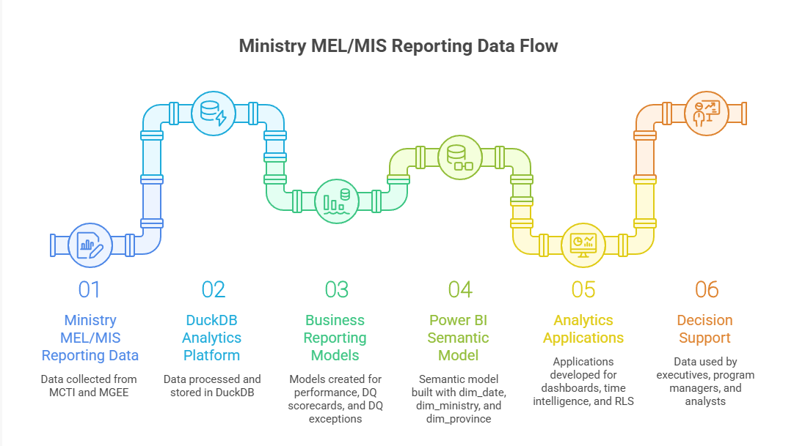
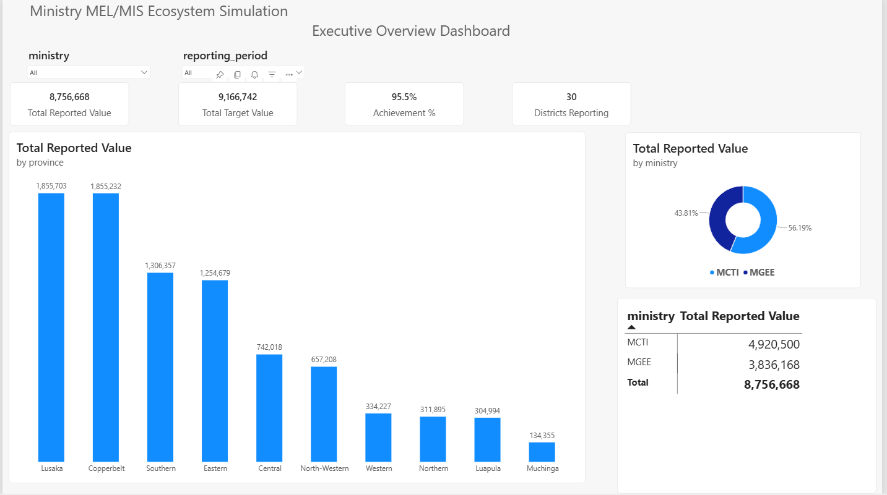
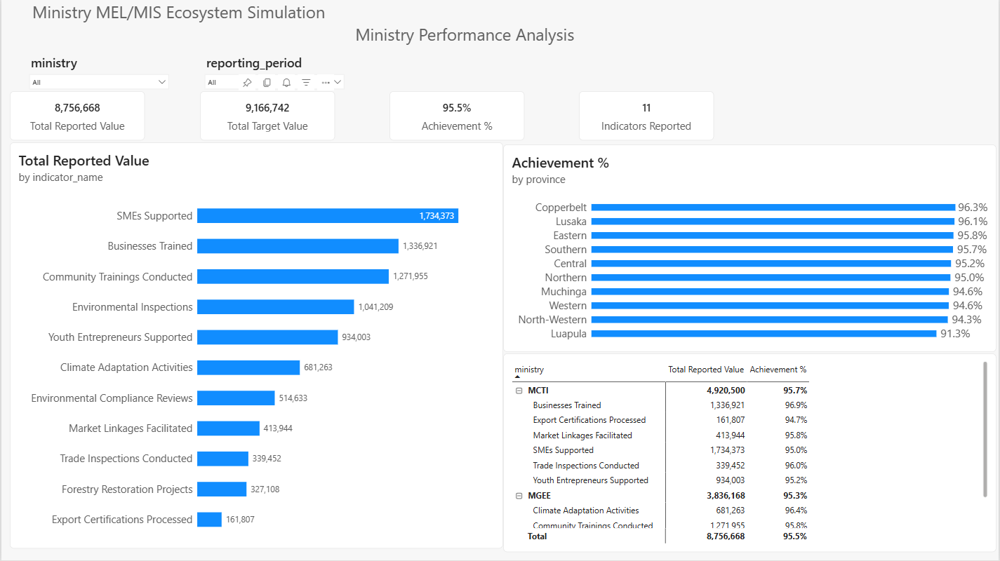
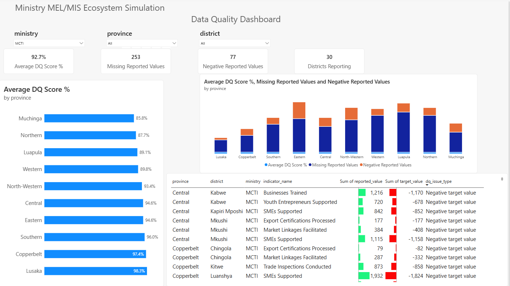
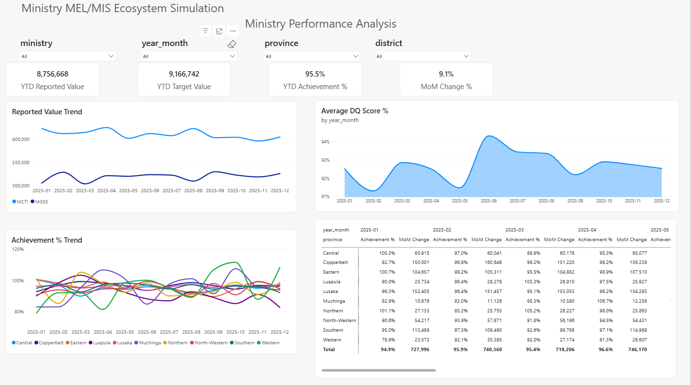
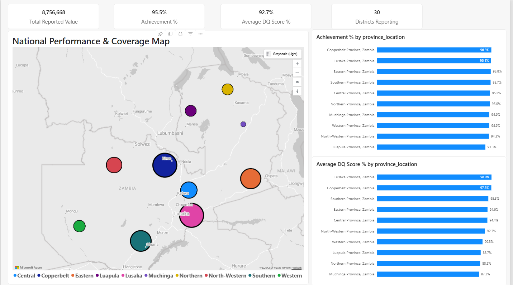
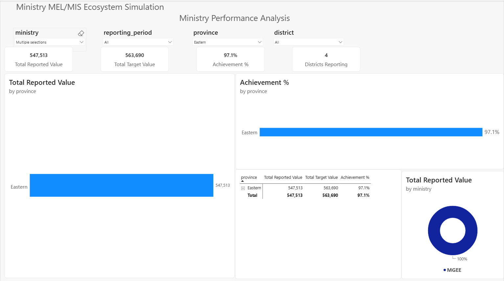
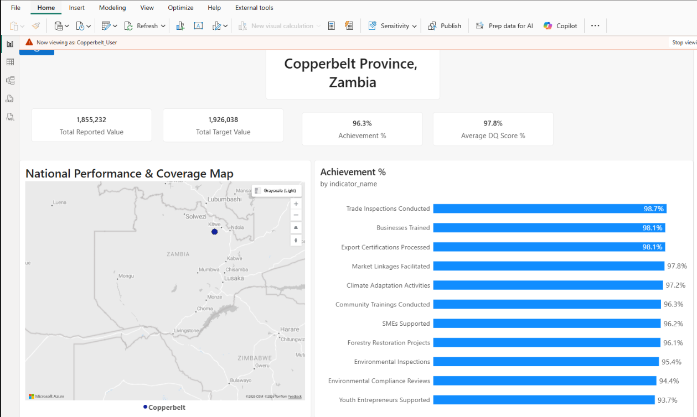

# Government Information Analytics Platform

## Portfolio Summary

This repository presents a full analytics engineering and Power BI portfolio project that simulates a Ministry Monitoring, Evaluation, Learning, and Management Information System (MEL/MIS) for government reporting. It demonstrates how raw ministry reporting data can be transformed into governed, decision-ready analytics for executives, program managers, M&E teams, provincial users, data managers, analysts, and technical reviewers.

The project is designed to show practical capability across Data Analyst, BI Analyst, Analytics Engineer, Reporting Analyst, and Power BI Developer responsibilities, including SQL transformation, dimensional modeling, semantic modeling, DAX measures, data quality monitoring, dashboard development, drillthrough analysis, geospatial reporting, and row-level security.

The solution simulates reporting operations for two government ministries:

- Ministry of Commerce, Trade and Industry (MCTI)
- Ministry of Green Economy and Environment (MGEE)

Rather than focusing only on dashboard development, the project emphasizes the complete analytical lifecycle from data modeling through decision support.

## Project Highlights

- Simulated government ministry MIS analytics platform
- SQL transformation and DuckDB analytical data layer
- dbt-style staging, dimension, mart, and Power BI reporting models
- Kimball-style dimensional modeling with conformed dimensions
- Power BI semantic model with reusable DAX measures
- Executive KPI dashboards and operational reporting pages
- Data quality scorecards and exception reporting
- Azure Maps geospatial analytics
- Drillthrough analysis and row-level security demonstration

## Recruiter Snapshot

This project demonstrates hands-on experience with:

- SQL-based analytics engineering and reporting transformations
- DuckDB analytical database modeling
- dbt-style staging, dimension, mart, and reporting layer design
- Kimball-style dimensional modeling using conformed dimensions and star schema principles
- Power BI semantic modeling, reusable DAX measures, and report development
- Executive KPI reporting, operational dashboards, and drillthrough analysis
- Data quality scorecards, exception reporting, and reporting governance
- Azure Maps geospatial analytics and province-level performance visualization
- Row-level security (RLS) using conformed dimension-based filtering
- End-to-end decision-support system design for public-sector reporting

## Business Problem

Many reporting systems collect large volumes of data but provide limited analytical capability for decision makers. In ministry and donor-funded program environments, this often creates slow reporting cycles, inconsistent performance views, limited data quality visibility, and difficulty moving from raw submissions to actionable insight.

This simulation demonstrates how modern analytics engineering principles can turn ministry reporting data into an enterprise decision-support platform that supports:

- Executive visibility into key performance indicators
- Program and ministry performance monitoring
- Provincial and district-level analysis
- Data quality oversight and exception management
- Geographic performance review
- Secure role-based reporting access
- Consistent semantic definitions across dashboards

## Architecture Snapshot



---

## Solution Architecture

The solution follows a modern analytics engineering architecture.

### Data Layer

DuckDB was used as the analytical database layer.

Responsibilities:

- Data storage
- Analytical querying
- Business reporting views

### Transformation Layer

SQL and dbt-style modeling principles were used to create reporting-ready structures.

Examples:

- Ministry performance views
- Data quality scorecards
- Data quality exception reporting

### Semantic Layer

Power BI was used as the semantic model and reporting layer.

The semantic model is built around conformed dimensions:

- dim_date
- dim_ministry
- dim_province

and reporting tables:

- pbi_ministry_performance
- pbi_dq_scorecard
- pbi_dq_exceptions

---

## Enterprise Analytics Features Demonstrated

### Dimensional Modeling

Implemented a Kimball-style dimensional model using:

- Conformed dimensions
- Star schema principles
- Shared business entities

### Semantic Modeling

Implemented:

- Reusable DAX measures
- Centralized business calculations
- Consistent filtering behavior

### Time Intelligence

Implemented:

- Date Dimension
- date_key
- Year-to-Date (YTD) analysis
- Month-over-Month (MoM) analysis
- Trend reporting

### Data Quality Monitoring

Implemented:

- Data Quality Scorecards
- Missing Value Monitoring
- Negative Value Detection
- Data Quality Exception Reporting

### Geospatial Analytics

Implemented:

- Azure Maps
- Province-level reporting
- Geographic performance visualization

### Drillthrough Analytics

Implemented:

- Province-to-District investigation
- Indicator-level exploration
- Context-aware navigation

### Row-Level Security (RLS)

Implemented:

- Province-specific security roles
- Conformed dimension-based filtering
- Enterprise-style access control

---

## Dashboard Portfolio

### Executive Overview

High-level KPI monitoring and executive visibility for fast review of ministry performance, reporting status, and priority areas.



### Ministry Performance Analysis

Performance analysis by ministry, indicator, and province to support program review and management reporting.



### Data Quality Dashboard

Monitoring of reporting quality, missing values, negative values, and exception management.



### Provincial Reporting Dashboard

Province and district performance analysis for decentralized monitoring and subnational reporting, demonstrated through the existing Executive Overview, Ministry Performance Analysis, and Geospatial Performance dashboards.

### Indicator Analysis Dashboard

Indicator-level reporting and performance review for detailed program and M&E analysis, demonstrated through the existing Executive Overview, Ministry Performance Analysis, and Geospatial Performance dashboards.

### Trend & Time Intelligence Dashboard

YTD, MoM, and trend monitoring to support period-over-period performance analysis.



### Geospatial Performance Dashboard

Azure Maps-based geographic reporting for province-level performance visualization.



### Province Drillthrough Dashboard

Analyst-oriented investigative reporting for moving from summary results into province and district detail.



### Row-Level Security Demo

Province-specific reporting access demonstration showing how enterprise-style security can be applied through the semantic model.



---

## Key Analytics Engineering Lessons

The most important lessons from this project were:

### Conformed Dimensions Simplify Everything

The dimensions:

- Province
- Ministry
- Date

became the foundation for:

- Security
- Drillthrough
- Time Intelligence
- Geographic Analysis
- Dashboard Interactivity

### Good Modeling Enables Advanced Features

Features such as:

- RLS
- Drillthrough
- Azure Maps
- Time Intelligence

became significantly easier because the underlying model was designed correctly.

### Data Quality Should Be Built Into The Architecture

Data quality monitoring should not be treated as an afterthought.

The project demonstrated how DQ scorecards and exception reporting can become first-class analytical products.

### Human Oversight Remains Essential

AI tools accelerated development significantly, but critical improvements came from:

- Business realism validation
- Dimensional modeling decisions
- Semantic design
- Relationship management
- Time intelligence design

---

## Technology Stack

### Data Platform

- DuckDB

### Analytics Engineering

- SQL
- dbt-style modeling concepts

### Business Intelligence

- Power BI
- DAX
- Azure Maps

### AI-Assisted Development

- ChatGPT
- Codex
- Continue

---

## How to Reproduce / Run Locally

This repository includes the simulated DuckDB database, dbt-style transformation project, ingestion scripts, Power BI model, architecture diagram, and dashboard screenshots needed to review the solution.

### Prerequisites

- Python 3.10+
- DuckDB Python package
- dbt with the DuckDB adapter
- Power BI Desktop

### Rebuild the Analytical Data Layer

From the repository root:

```powershell
python ingestion\scripts\load_ministry_reports.py
```

This loads the simulated ministry reporting CSV files into:

```text
database/ministry_mis.duckdb
```

### Run the dbt Models

The dbt project lives in:

```text
dbt_ministry_mis/ministry_mis/
```

Create or update your local dbt profile named `ministry_mis` so it points to the DuckDB database:

```yaml
ministry_mis:
  target: dev
  outputs:
    dev:
      type: duckdb
      path: ../../database/ministry_mis.duckdb
```

Then run:

```powershell
cd dbt_ministry_mis\ministry_mis
dbt parse
dbt build
```

The dbt models create staging, conformed dimensions, analytical marts, data quality views, and Power BI-ready reporting views.

### Review the Power BI Report

Open the Power BI report file:

```text
dbt_ministry_mis/ministry_mis/models/powerbi/pbix/mcti_mgee_sim.pbix
```

The dashboard screenshots in the `screenshots/` folder show the main report pages for quick GitHub review.

---

## Repository Structure

```text
government-information-analytics-platform/
|-- architecture/          Solution architecture diagram and supporting assets
|-- consultancy_outputs/   Supporting project outputs
|-- database/              DuckDB analytical database
|-- dbt_ministry_mis/      dbt-style analytics engineering project
|-- Docs/                  Executive, architecture, dashboard, and portfolio notes
|-- ingestion/             Data loading, validation, and processing scripts
|-- screenshots/           Power BI dashboard screenshots
|-- shared_reference/      Shared reference data such as geography
|-- simulation_scripts/    Scripts used to generate simulated ministry data
`-- README.md              Public portfolio overview
```

---

## Documentation

See the Docs folder for:

- Executive Summary
- Architecture Overview
- Dashboard Catalog
- Lessons Learned

---

## Portfolio Value

This project demonstrates that enterprise analytics solutions are not primarily about dashboards.

They are about:

- Data Modeling
- Semantics
- Architecture
- Governance
- Security
- Business Understanding

The simulation was intentionally designed to showcase analytics engineering thinking and enterprise reporting concepts rather than simply producing visualizations.

For recruiters, hiring managers, consulting clients, and technical reviewers, the project provides evidence of practical ability to design reporting data models, build Power BI dashboards, define semantic calculations, monitor data quality, apply RLS, and connect analytics outputs to real decision-support needs.

---

## Author

Jonathan Mukundu

Analytics Engineering Portfolio Project

Focus Areas:

- Analytics Engineering
- Power BI
- Data Quality
- Government MIS Systems
- Semantic Modeling
- Decision Support Systems
- Geospatial Reporting
